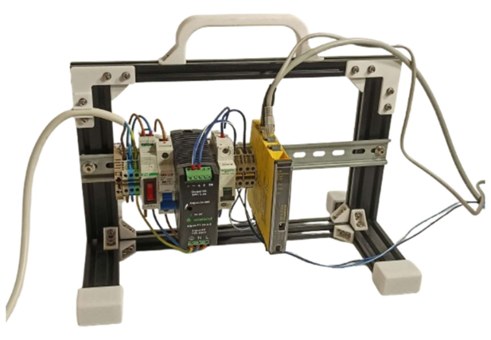
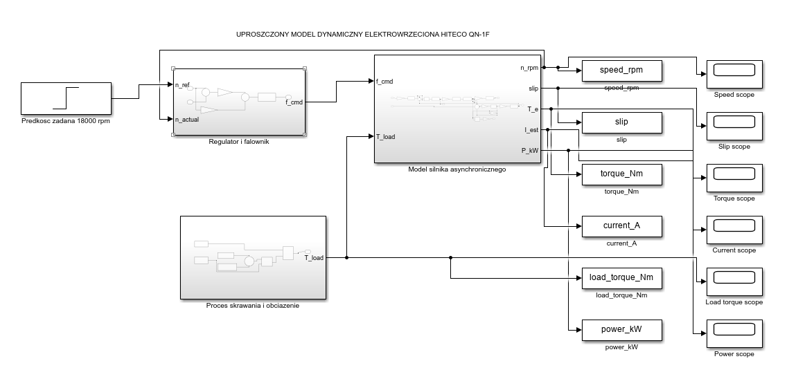
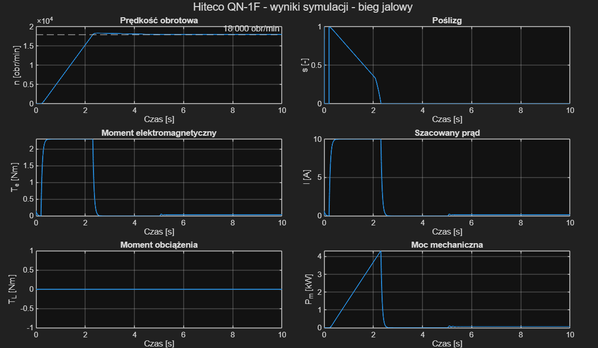
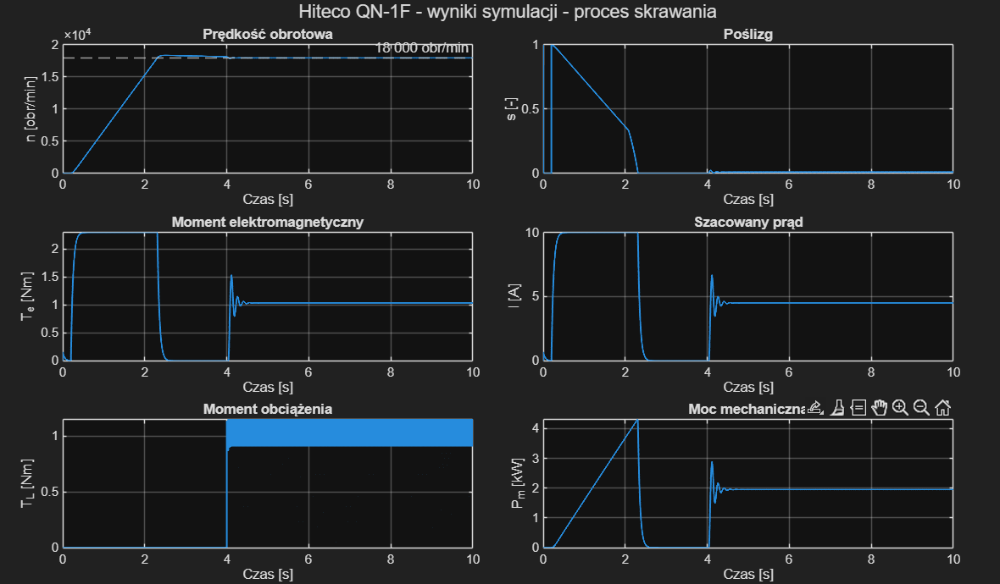

# Electric Motor Diagnostic System Using Industrial Communication and Time-Series Databases

Engineering portfolio case study based on a master's thesis project. The project focused on integrating industrial sensing, communication, edge data acquisition, time-series storage, and visualization for condition monitoring of an electric electrospindle during machining tests.

> **Project type:** industrial integration / OT-IT monitoring system  
> **Main technologies:** Modbus RTU, RS-485, TURCK IM18-CCM60, VictoriaMetrics, Grafana, Ethernet, MATLAB/Simulink\
> **Monitored quantities:** vibration indicators (Vrms, Arms, HFK), spindle housing temperature, ambient temperature and humidity

## System architecture

```text
QM30VT3 vibration & temperature sensor
                |
                |  Modbus RTU over RS-485
                v
        TURCK IM18-CCM60
           Edge Module
                |
                |-- data acquisition / edge services
                |-- VictoriaMetrics time-series database
                `-- Grafana visualization
                |
                |  Ethernet (web access to services)
                v
               PC
```

The sensor communicates with the edge module through **Modbus RTU over RS-485**. Measurement data are stored as time-series data in **VictoriaMetrics** and visualized in **Grafana** running on the edge platform. A PC connected to the edge module over Ethernet is used to access the module and its web-based monitoring services.

## Project scope

The work covered the complete integration path from the physical sensor connection to data visualization. It included:

- selection and mounting of the vibration sensor on the electrospindle,
- RS-485 physical connection and Modbus RTU configuration,
- configuration of the IM18-CCM60 edge module,
- acquisition and storage of measurement data,
- time-series visualization in Grafana,
- monitoring of edge-device operating parameters,
- export and analysis of selected measurement records,
- design and manufacture of a supporting frame for electrical equipment,
- preparation of technical and electrical documentation,
- development of a simplified MATLAB/Simulink drive model for no-cutting and cutting-load scenarios.

No custom application code was required for the core system - the engineering task was primarily **industrial system integration, configuration, measurement, and analysis**.

## Hardware

### Electrospindle

The monitored object was a Hiteco QN-series electrospindle used during machining operations.


### Sensor and edge module

The measurement chain used a **Banner QM30VT3** vibration/temperature sensor and a **TURCK IM18-CCM60** edge module.


### Sensor mounting

A dedicated mounting base was attached to the spindle housing to provide a repeatable sensor installation.


## Mechanical and electrical design

A supporting structure for the electrical equipment was designed in Autodesk Inventor and manufactured for the test setup.

| CAD model | Built structure |
|---|---|
|  |  |

Selected author-created documentation is included to show both system integration and mechanical-design work:

- [Support frame assembly drawing](docs/mechanical-design/support-frame-assembly-drawing.pdf)
- [Profile foot manufacturing drawing](docs/mechanical-design/profile-foot-drawing.pdf)
- [Support frame bracket manufacturing drawing](docs/mechanical-design/support-frame-bracket-drawing.pdf)
- [Cable holder manufacturing drawing](docs/mechanical-design/cable-holder-drawing.pdf)
- [Sensor mounting base drawing](docs/mechanical-design/sensor-mounting-base-drawing.pdf)
- [Electrical schematic](docs/electrical/electrical-schematic.pdf)

The individual part drawings were prepared in Autodesk Inventor and are included to demonstrate practical mechanical-design and technical-documentation skills in addition to the OT/IT integration work.

## MATLAB/Simulink model

A simplified dynamic model was developed in MATLAB/Simulink to illustrate the electrospindle drive response during startup and under a simulated cutting load. The top-level model combines a controller and inverter block, an induction-motor model, and a cutting-process/load block, with a speed reference of **18,000 rpm**.

This is an illustrative, simplified drive model based on an induction-motor representation; it is not a validated digital twin of the physical Hiteco electrospindle. The plots below show simulation outputs, separately from the sensor measurements presented later in this README. Current is an estimated model output.

### Top-level model



### A. Operation without cutting

The no-cutting case illustrates startup and settling at the reference speed with zero applied cutting-load torque. The low steady-state torque and estimated current reflect the model simplifications and should not be interpreted as measured no-load values of the real spindle.



### B. Operation with cutting

A simulated cutting load is applied at approximately **4 s**. The model shows a transient response followed by settling, with increased electromagnetic torque, estimated current and mechanical power compared with the no-cutting case.



The figures show rotational speed, slip, electromagnetic torque, estimated current, applied load torque and mechanical power. Figure labels are retained in Polish from the thesis. The model and supporting MATLAB files are included below.

### Model files and running the simulation

- [Simulink model](matlab/QN1F_induction_motor_v10.slx)
- [Model parameters](matlab/QN1F_params_v10.m)
- [Results plotting function](matlab/QN1F_plot_results_v10.m)

The model was saved in **MATLAB/Simulink R2025b (Update 5)**. Compatibility with earlier releases has not been verified.

1. Set the MATLAB current folder to the repository's `matlab` directory, keeping all three files together.
2. Open `QN1F_induction_motor_v10.slx`. Its `PreLoadFcn` callback automatically runs `QN1F_params_v10.m` to load the parameters into the base workspace.
3. Open the **Proces skrawania i obciazenie** subsystem and use the **TRYB PRACY** manual switch to select either **Bieg jalowy** (zero cutting load) or the cutting-load signal.
4. Run the simulation for the configured **10 s**. The `StopFcn` callback automatically calls `QN1F_plot_results_v10` to plot the six logged signals.
5. Select the other operating mode and run again to compare the two cases. Save the first figure before rerunning: the plotting function replaces the previous results figure.

If you edit the parameter script while the model is already open, run `QN1F_params_v10` again before simulating. The supplied parameters apply the cutting load at **4 s**, with a mean torque of **1.0 Nm** and a sinusoidal amplitude of **0.15 Nm**. Estimated current is derived from electromagnetic torque using the nominal current-to-torque ratio; it is not a detailed electrical current model.

## Industrial communication

### RS-485 physical connection


### Modbus RTU configuration


The acquisition side of the system uses **Modbus RTU over RS-485** between the QM30VT3 sensor and the IM18-CCM60.

### Ethernet configuration

The PC and the IM18-CCM60 were connected directly over Ethernet and configured with static IPv4 addresses in the same local subnet. The PC used `192.168.0.20`, while the edge module used `192.168.0.100`. This network connection provided access from the PC to the edge module and its browser-based monitoring environment.

| PC network configuration | IM18-CCM60 network configuration |
|---|---|
|  |  |

## Time-series monitoring and visualization

VictoriaMetrics was used for time-series data storage on the edge platform, while Grafana provided dashboards for measurement visualization and system monitoring.

### Vibration monitoring


### Edge module operating parameters


### Built-in sensor monitoring


## Measured parameters

The selected diagnostic and environmental quantities included:

- **Vrms** - RMS vibration velocity,
- **Arms** - RMS vibration acceleration,
- **HFK** - high-frequency vibration indicator,
- **spindle housing temperature**,
- **ambient temperature**,
- **ambient humidity**.

The repository contains selected plots from a broader experimental campaign performed during the thesis work.

## Selected measurement cases

Three representative cases are shown below. These are examples only and do not represent the complete set of experiments performed during the project.

### Test 1 - Polyamide machining

| Vrms | Arms |
|---|---|
|  |  |

| HFK | Temperature |
|---|---|
|  |  |

### Test 2 - Aluminium machining

| Vrms | Arms |
|---|---|
|  |  |

| HFK | Temperature |
|---|---|
|  |  |

### Test 3 - Dry run

The machining program was executed without workpiece material, providing a reference case without cutting load.

| Vrms | Arms |
|---|---|
|  |  |

| HFK | Temperature |
|---|---|
|  |  |

## Repository scope and confidentiality

This repository is a **selected public portfolio presentation**, not a complete archive of the master's thesis or all experimental data. Company-provided machine G-code and operator program documentation are intentionally excluded. The repository includes only selected technical material needed to explain the system architecture, configuration, measurements, and author-created engineering documentation.

## Skills demonstrated

This project demonstrates practical experience in:

- industrial communication and Modbus RTU,
- RS-485 sensor integration,
- edge computing and industrial data acquisition,
- time-series databases,
- Grafana dashboard design,
- condition-monitoring measurements,
- OT/IT integration,
- electrical and mechanical technical documentation,
- experimental testing and engineering data analysis,
- simplified drive modeling and simulation in MATLAB/Simulink.
