# Electric Motor Diagnostic System Using Industrial Communication and Time-Series Databases

Engineering portfolio case study based on a master's thesis project. The project focused on integrating industrial sensing, communication, edge data acquisition, time-series storage, and visualization for condition monitoring of an electric electrospindle during machining tests.

> **Project type:** industrial integration / OT-IT monitoring system  
> **Main technologies:** Modbus RTU, RS-485, TURCK IM18-CCM60, VictoriaMetrics, Grafana, Ethernet  
> **Monitored quantities:** vibration indicators (Vrms, Arms, HFK), spindle housing temperature, ambient temperature and humidity

## System architecture

```text
QM30VT3 vibration & temperature sensor
                |
                |  Modbus RTU over RS-485
                v
        TURCK IM18-CCM60
           Edge Module
                |
                |-- data acquisition / edge services
                |-- VictoriaMetrics time-series database
                `-- Grafana visualization
                |
                |  Ethernet (web access to services)
                v
               PC
```

The sensor communicates with the edge module through **Modbus RTU over RS-485**. Measurement data are stored as time-series data in **VictoriaMetrics** and visualized in **Grafana** running on the edge platform. A PC connected to the edge module over Ethernet is used to access the module and its web-based monitoring services.

## Project scope

The work covered the complete integration path from the physical sensor connection to data visualization. It included:

- selection and mounting of the vibration sensor on the electrospindle,
- RS-485 physical connection and Modbus RTU configuration,
- configuration of the IM18-CCM60 edge module,
- acquisition and storage of measurement data,
- time-series visualization in Grafana,
- monitoring of edge-device operating parameters,
- export and analysis of selected measurement records,
- design and manufacture of a supporting frame for electrical equipment,
- preparation of technical and electrical documentation.

No custom application code was required for the core system - the engineering task was primarily **industrial system integration, configuration, measurement, and analysis**.

## Hardware

### Electrospindle

The monitored object was a Hiteco QN-series electrospindle used during machining operations.

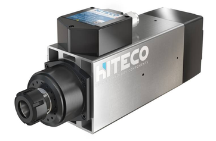

### Sensor and edge module

The measurement chain used a **Banner QM30VT3** vibration/temperature sensor and a **TURCK IM18-CCM60** edge module.

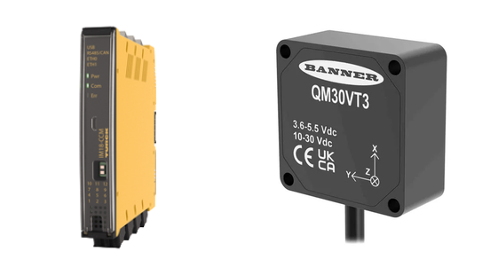

### Sensor mounting

A dedicated mounting base was attached to the spindle housing to provide a repeatable sensor installation.

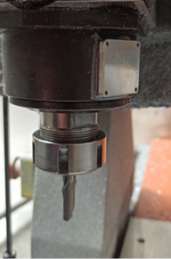

## Industrial communication

### RS-485 physical connection

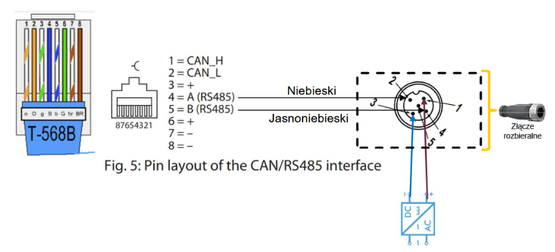

### Modbus RTU configuration

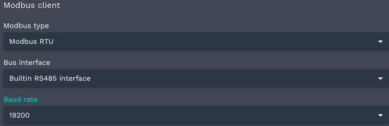

The acquisition side of the system uses **Modbus RTU over RS-485** between the QM30VT3 sensor and the IM18-CCM60.

### Ethernet configuration

The PC and the IM18-CCM60 were connected directly over Ethernet and configured with static IPv4 addresses in the same local subnet. The PC used `192.168.0.20`, while the edge module used `192.168.0.100`. This network connection provided access from the PC to the edge module and its browser-based monitoring environment.

| PC network configuration | IM18-CCM60 network configuration |
|---|---|
| 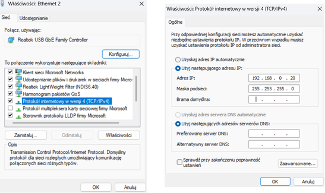 | 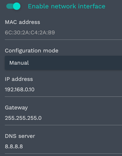 |

## Time-series monitoring and visualization

VictoriaMetrics was used for time-series data storage on the edge platform, while Grafana provided dashboards for measurement visualization and system monitoring.

### Vibration monitoring

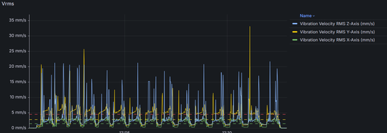

### Edge module operating parameters

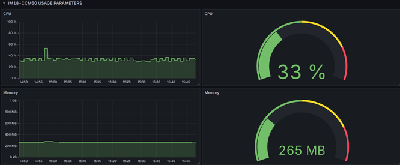

### Built-in sensor monitoring

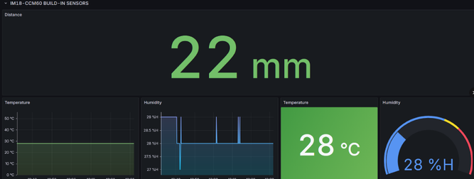

## Measured parameters

The selected diagnostic and environmental quantities included:

- **Vrms** - RMS vibration velocity,
- **Arms** - RMS vibration acceleration,
- **HFK** - high-frequency vibration indicator,
- **spindle housing temperature**,
- **ambient temperature**,
- **ambient humidity**.

The repository contains selected plots from a broader experimental campaign performed during the thesis work.

## Selected measurement cases

Three representative cases are shown below. These are examples only and do not represent the complete set of experiments performed during the project.

### Test 1 - Polyamide machining

| Vrms | Arms |
|---|---|
| 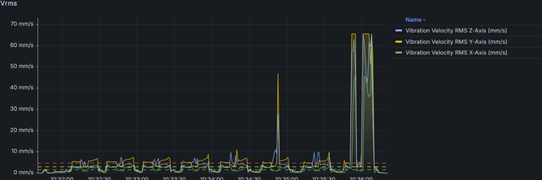 | 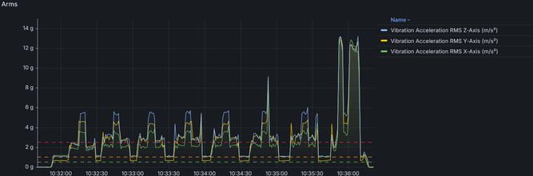 |

| HFK | Temperature |
|---|---|
| 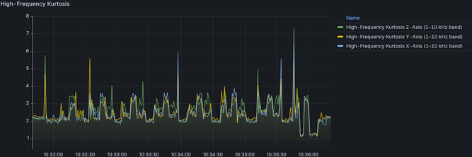 | 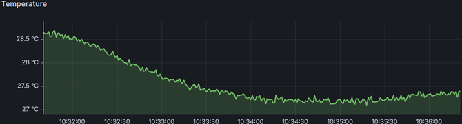 |

### Test 2 - Aluminium machining

| Vrms | Arms |
|---|---|
| 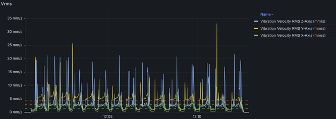 | 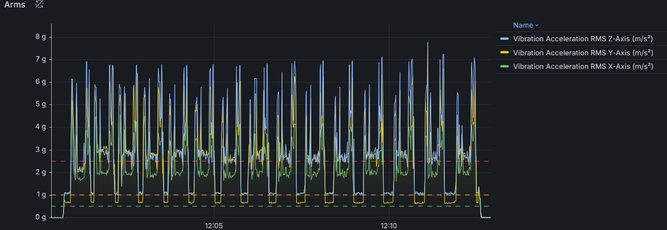 |

| HFK | Temperature |
|---|---|
| 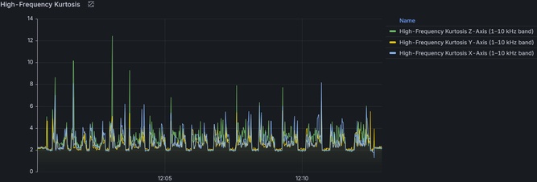 | 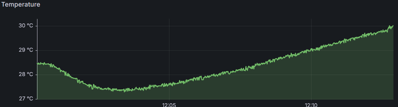 |

### Test 3 - Dry run

The machining program was executed without workpiece material, providing a reference case without cutting load.

| Vrms | Arms |
|---|---|
| 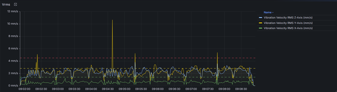 | 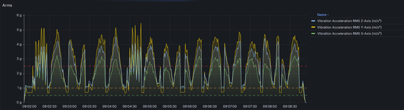 |

| HFK | Temperature |
|---|---|
| 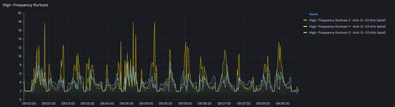 | 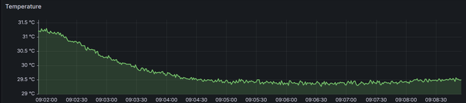 |

## Mechanical and electrical design

A supporting structure for the electrical equipment was designed in Autodesk Inventor and manufactured for the test setup.

| CAD model | Built structure |
|---|---|
| 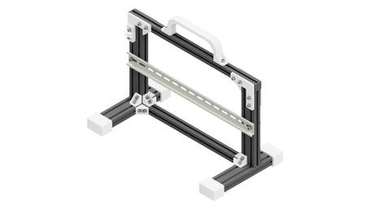 | 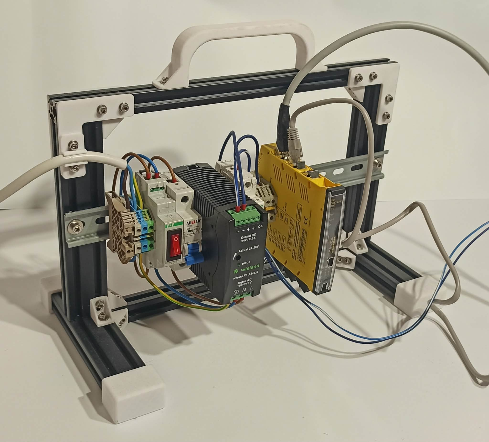 |

Selected author-created documentation is included to show both system integration and mechanical-design work:

- [Support frame assembly drawing](docs/mechanical-design/support-frame-assembly-drawing.pdf)
- [Profile foot manufacturing drawing](docs/mechanical-design/profile-foot-drawing.pdf)
- [Support frame bracket manufacturing drawing](docs/mechanical-design/support-frame-bracket-drawing.pdf)
- [Cable holder manufacturing drawing](docs/mechanical-design/cable-holder-drawing.pdf)
- [Sensor mounting base drawing](docs/mechanical-design/sensor-mounting-base-drawing.pdf)
- [Electrical schematic](docs/electrical/electrical-schematic.pdf)

The individual part drawings were prepared in Autodesk Inventor and are included to demonstrate practical mechanical-design and technical-documentation skills in addition to the OT/IT integration work.

## Repository scope and confidentiality

This repository is a **selected public portfolio presentation**, not a complete archive of the master's thesis or all experimental data. Company-provided machine G-code and operator program documentation are intentionally excluded. The repository includes only selected technical material needed to explain the system architecture, configuration, measurements, and author-created engineering documentation.

## Skills demonstrated

This project demonstrates practical experience in:

- industrial communication and Modbus RTU,
- RS-485 sensor integration,
- edge computing and industrial data acquisition,
- time-series databases,
- Grafana dashboard design,
- condition-monitoring measurements,
- OT/IT integration,
- electrical and mechanical technical documentation,
- experimental testing and engineering data analysis.
